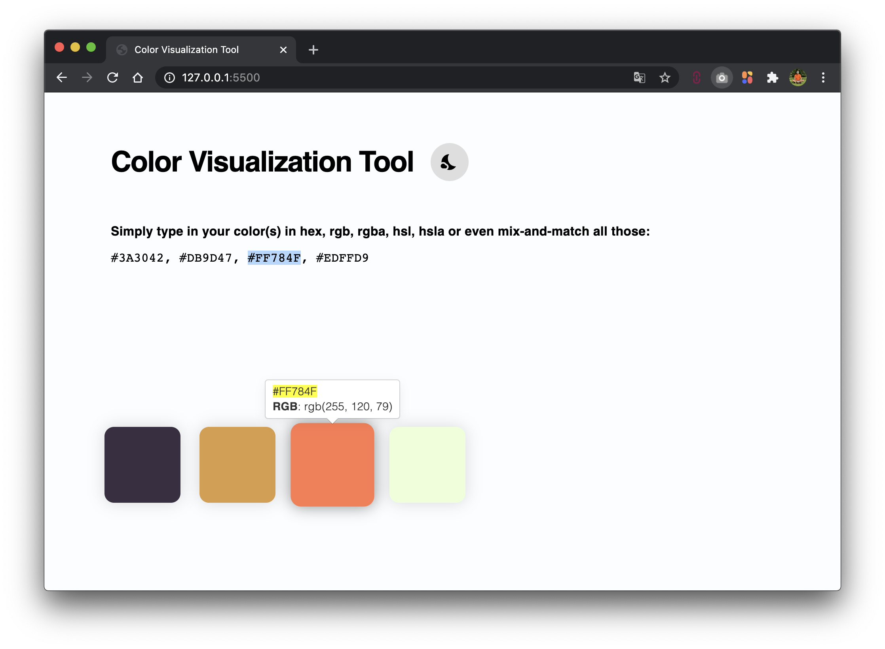
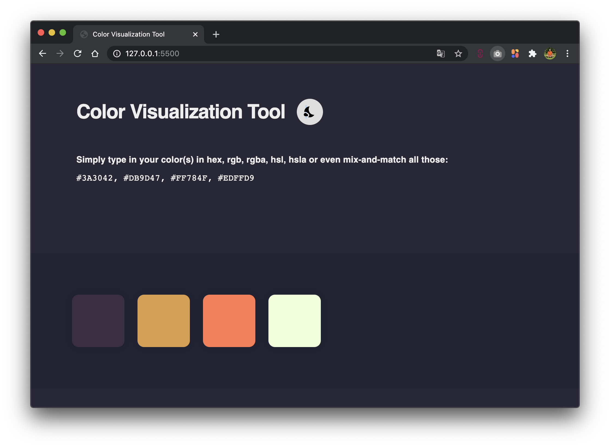

# 🎨  Color Visualization Tool

  
Got a bunch of hex, rgb or hsl colors that you need to visualize and see how they look compared to each other?
You have the right tool in hand! Go on, use it, it's FREE!

https://kishannareshpal.github.io/colorvisualizationtool

# License
[GNU General Public License v3.0](https://choosealicense.com/licenses/gpl-3.0/)